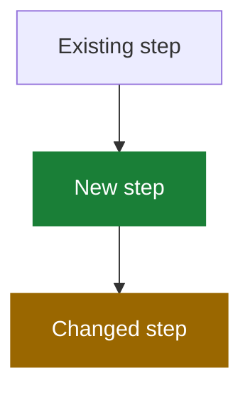

# Write a PR Description

Help a reviewer understand why the change exists, what behavior changed, and how it was verified within 60 seconds.

Assume the reviewer has the diff open. Explain intent, behavior, risk, and verification—not implementation already visible in the code. Use only supported facts, never invent paths or results, and omit empty sections.

## Opening

Start with one or two plain-language sentences stating the bug or goal and the fix. Do not add a TL;DR heading.

## What changed

- Use one bullet per logical behavior change, with about six bullets maximum.
- Lead with the outcome, not the implementation or investigation.
- Use a short before → after comparison when helpful.
- Recommend a separate PR for unrelated changes.

## Visualize changed flows

Use a small Mermaid diagram when it replaces a longer technical explanation. Show behavior and relationships rather than code-level implementation. Diagram only the new flow, and name the section after what it shows, such as `Import flow`.

Highlight additions and changed behavior when useful:

Add a text legend: 🟩 added, 🟨 changed, gray/default unchanged. Keep labels understandable without relying on color alone. Omit the diagram when prose is shorter.

## Data changes

When stored data or an API payload changes, use a small table showing the key, value, and owner or lifetime, plus one before → after line. Omit otherwise.

## Verification

- Report what behavior is now proven, not how the tools were invoked: name the scenarios the new tests lock in.
- No command lines, local paths, env vars, or raw counts ("9 tests, 40 assertions") — "new tests cover X, Y, Z" is the whole story.
- Skip routine checks CI already reports (lint, static analysis, formatting) unless one is the point of the PR.
- A pre-existing unrelated failure gets one short clause at most, never its internals.
- Add numbered manual steps only when they provide useful coverage beyond automation; end each step with the expected result, original regression scenario first.
- Never claim a check passed without evidence.

## Link the issue on GitHub

When GitHub access is available and the issue is known, link the pull request through GitHub's native **Development** sidebar. Treat this as GitHub metadata, not a section in the PR description.

Link the pull request itself, never the branch. A branch named after the issue (such as `bugfix/686`) shows up in Development as a branch link — that is not enough; verify the Development section lists the PR and remove leftover branch-only links.

Do not add a closing keyword by default. Use `Fixes #123` only when the user explicitly wants automatic closure and the pull request targets the repository's default branch. If GitHub access is unavailable, mention outside the ready-to-paste description that the issue still needs to be linked.

## Do not include

- A line-by-line retelling of the diff.
- Investigation history or obvious implementation details.
- Self-praise such as “robust,” “comprehensive,” or “properly.”
- Empty sections, placeholders, invented facts, or sensitive information.
- Jargon or codenames that do not appear in the product or code.
