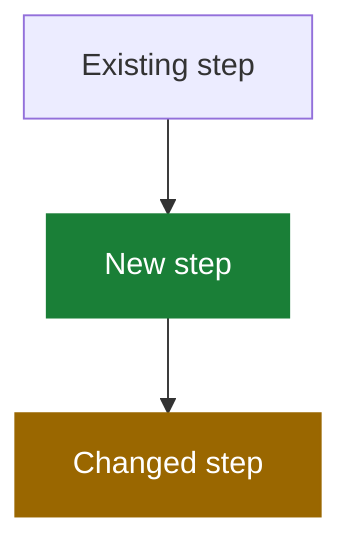

# Write a PR Description

Help a reviewer understand why the change exists, what behavior changed, where to start, and how it was verified within 60 seconds.

Assume the reviewer has the diff open. Explain intent, behavior, risk, and verification—not implementation already visible in the code. Use only supported facts, never invent paths or results, and omit empty sections.

## Opening

Start with one or two plain-language sentences stating the bug or goal and the fix. Do not add a TL;DR heading.

## What changed

- Use one bullet per logical behavior change, with about six bullets maximum.
- Lead with the outcome, not the implementation or investigation.
- Use a short before → after comparison when helpful.
- Recommend a separate PR for unrelated changes.

## Where to start reviewing

For non-trivial PRs, name 2–4 real paths and the function or reason to inspect each. Identify mechanical or generated changes that only need a skim. Omit this section when repository context is unavailable rather than inventing paths.

## Visualize changed flows

Use a small Mermaid diagram when it replaces a longer technical explanation. Show behavior and relationships rather than code-level implementation. Diagram only the new flow, and name the section after what it shows, such as `Import flow`.

Highlight additions and changed behavior when useful:

Add a text legend: 🟩 added, 🟨 changed, gray/default unchanged. Keep labels understandable without relying on color alone. Omit the diagram when prose is shorter.

## Data changes

When stored data or an API payload changes, use a small table showing the key, value, and owner or lifetime, plus one before → after line. Omit otherwise.

## Verification

- State the checks actually run and their results.
- Add numbered manual steps only when they provide useful coverage beyond automation; end each step with the expected result.
- Put the original regression scenario first when manual verification adds value.
- Never claim a check passed without evidence.

## Metadata

Add issue links such as `Fixes #123`, a non-default base branch, and related PRs when known.

## Do not include

- A line-by-line retelling of the diff.
- Investigation history or obvious implementation details.
- Self-praise such as “robust,” “comprehensive,” or “properly.”
- Empty sections, placeholders, invented facts, or sensitive information.
- Jargon or codenames that do not appear in the product or code.
