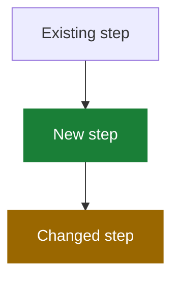

# Write a PR Description

## 1. Purpose

1.1. Help a reviewer understand why the change exists, what behavior changed, and how to QA it within 60 seconds.

1.2. Assume the reviewer has the diff open. Explain intent, behavior, and risk—not implementation already visible in the code.

1.3. Use only supported facts, never invent paths or results, and omit empty sections.

## 2. Opening

2.1. Start with one or two plain-language sentences stating the bug or goal and the fix.

2.2. Do not add a TL;DR heading.

## 3. What changed

3.1. Use one bullet per logical behavior change, with about six bullets maximum.

3.2. Lead with the outcome, not the implementation or investigation.

3.3. Use a short before → after comparison when helpful.

3.4. Recommend a separate PR for unrelated changes.

## 4. Visualize changed flows

4.1. Use a small Mermaid diagram when it replaces a longer technical explanation. Show behavior and relationships rather than code-level implementation.

4.2. Diagram only the new flow, and name the section after what it shows, such as `Import flow`.

4.3. Highlight additions and changed behavior when useful:

4.4. Add a text legend: 🟩 added, 🟨 changed, gray/default unchanged. Keep labels understandable without relying on color alone.

4.5. Omit the diagram when prose is shorter.

## 5. Data changes

5.1. When stored data or an API payload changes, use a small table showing the key, value, and owner or lifetime, plus one before → after line.

5.2. Omit otherwise.

## 6. QA

6.1. Never write a Verification section — no test summaries, tool invocations, or raw counts, even when rewriting a description that had one. Tests are visible in the diff and CI reports the results.

6.2. The only testing content is a QA section: numbered manual steps a QA person can follow, original regression scenario first, each step ending with the expected result.

6.3. Omit the section when there is nothing meaningful to check by hand.

## 7. Link the issue on GitHub

7.1. When GitHub access is available and the issue is known, link the pull request through GitHub's native **Development** sidebar. Treat this as GitHub metadata, not a section in the PR description.

7.2. Link the pull request itself, never the branch. A branch named after the issue (such as `bugfix/686`) shows up in Development as a branch link — that is not enough; verify the Development section lists the PR and remove leftover branch-only links.

7.3. Do not add a closing keyword by default. Use `Fixes #123` only when the user explicitly wants automatic closure and the pull request targets the repository's default branch.

7.4. If GitHub access is unavailable, mention outside the ready-to-paste description that the issue still needs to be linked.

## 8. Do not include

8.1. A Verification section, in any form.

8.2. A line-by-line retelling of the diff.

8.3. Investigation history or obvious implementation details.

8.4. Self-praise such as “robust,” “comprehensive,” or “properly.”

8.5. Empty sections, placeholders, invented facts, or sensitive information.

8.6. Jargon or codenames that do not appear in the product or code.
