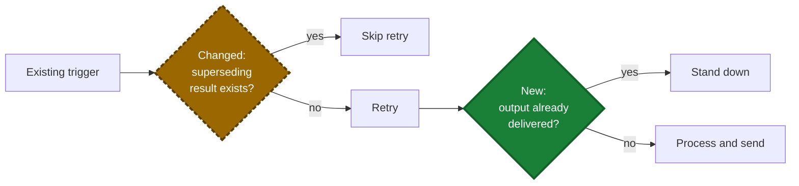

# Write a PR Description

## 1. Purpose

1.1. Help a reviewer understand the system context, why the change exists, what behavior changed, and how to QA it within 60 seconds.

1.2. Assume the reviewer has the diff open but may not know the affected code or workflow. Explain intent, end-to-end behavior, and risk—not implementation already visible in the code.

1.3. Use only supported facts, never invent paths or results, and omit empty sections.

## 2. Opening

2.1. Start with one or two plain-language sentences stating the bug or goal and the fix.

2.2. Do not add a TL;DR heading.

2.3. Name the system when referencing an external ticket or conversation — `[HelpScout conversation 3393395616](url)`, linked when possible. Never a bare `#id`: on GitHub it reads as an issue reference.

## 3. What changed

3.1. Use one bullet per logical behavior change, with about six bullets maximum.

3.2. Lead with the outcome, not the implementation or investigation.

3.3. Use a short before → after comparison when helpful.

3.4. Recommend a separate PR for unrelated changes.

3.5. Start each bullet with the changed component in bold (`**Guard** — stands down when…`) so a reviewer can jump to the bullet matching the file they have open. Separate bullets with a blank line so GitHub renders a padded list.

3.6. Put a cross-cutting caveat — an assumption the fix relies on, or intentional behavior a reviewer may read as a bug — in a `> [!NOTE]` callout after the bullets, not inline where it stretches a bullet.

## 4. Visualize changed flows

4.1. Include a Mermaid diagram by default when a change affects a workflow, background job, retry, state transition, guard sequence, or interaction between components. Give an unfamiliar reviewer a high-level map of how the relevant system behaves after the change.

4.2. Show the post-change end-to-end flow, including enough unchanged context to explain where the changed behavior sits. Do not create separate before and after diagrams unless the structural difference cannot be understood through highlighting. Name the section after what it shows, such as `Import flow`.

4.3. Include the trigger, important decisions, component boundaries, failure or retry paths when relevant, and terminal outcomes. Keep the overview compact—prefer about ten nodes or fewer, collapse code-level details, and use the same product terms as the prose. Use named subgraphs sparingly when ownership across components would otherwise be unclear.

4.4. Make every decision complete and logically consistent. Its outgoing labels must answer the question, be mutually exclusive, and cover relevant exceptions. Prefer `Yes`/`No` when the criteria fit inside the decision; otherwise state the criteria on both branches.

4.5. Apply status styling to the step or decision whose behavior changed, not to an unchanged downstream result:

- `added`: a new step, check, or branch condition
- `changed`: an existing step or decision whose rule changed
- unstyled: behavior unchanged in this pull request

Do not mark an existing outcome as added or changed merely because the pull request provides a new way to reach it.

4.6. Encode status in text as well as color. Prefix highlighted node labels with `New:` or `Changed:`, render added behavior as solid green, and render changed behavior as dashed amber:

4.7. Do not add a separate legend line — the `New:`/`Changed:` prefixes already carry status in text, and color is reinforcement, not the only signal.

4.8. Let the diagram carry sequence and branching. Keep accompanying bullets for outcomes, caveats, or risk instead of narrating every arrow again. Omit the diagram only when the change has no meaningful flow to visualize.

4.9. GitHub scales the rendered diagram to the page width, so on-screen text size is set by the diagram's geometry — font-size directives change nothing. Prefer `flowchart LR`, and keep decision labels to two or three short lines: Mermaid inscribes the text box inside a rhombus, so long labels balloon the shape and the whole diagram. When branch criteria do not fit a short edge label, state them in the prose bullets instead.

## 5. Data changes

5.1. When stored data or an API payload changes, use a small table showing the key, value, and owner or lifetime, plus one before → after line.

5.2. Omit otherwise.

## 6. QA

6.1. Never write a Verification section — no test summaries, tool invocations, or raw counts, even when rewriting a description that had one. Tests are visible in the diff and CI reports the results.

6.2. The only testing content is a QA section: numbered manual steps a QA person can follow, original regression scenario first. End each step with a standalone `**Expect:**` line stating the observable result, separated from the action.

6.3. Omit the section when there is nothing meaningful to check by hand.

6.4. Make setup actionable: when a step needs something a QA person cannot do through the product (plant a database row, mark a run failed), give the exact snippet — tinker, SQL, or CLI — in a fenced code block, plus any ordering constraint it depends on.

6.5. Spend QA steps on what automated tests cannot cover — live third-party behavior, assumptions about external systems. Do not hand-replicate scenarios the diff's tests already prove.

## 7. Link the issue on GitHub

7.1. When the issue is known, always link it with a closing keyword on its own line at the end of the body. This is GitHub's only API-level linking mechanism — there is no REST or GraphQL mutation for it, so the keyword in the PR body *is* the API. GitHub then lists the PR under the issue's Development section and closes the issue on merge.

7.2. Derive the reference from the issue URL — `https://github.com/OWNER/REPO/issues/123`:

- Same repository as the PR: `Closes #123`
- Different repository: `Closes OWNER/REPO#123`
- Several issues: repeat the keyword for each — `Closes #123, closes OWNER/REPO#456`

7.3. Accepted keywords are `close`/`closes`/`closed`, `fix`/`fixes`/`fixed`, `resolve`/`resolves`/`resolved`. Prefer `Closes` for issues and `Fixes` for bugs. A bare `#123` without a keyword creates only a cross-reference, never a link.

7.4. GitHub interprets the keyword only when the pull request targets the repository's **default branch**. When it targets anything else — a release or stacked branch — the keyword silently does nothing: link the PR through the **Development** sidebar instead and say so outside the ready-to-paste description.

7.5. Keep the keyword in the PR body, not in a commit message. A keyword in a commit closes the issue but does not list the pull request as linked.

7.6. Link the pull request itself, never the branch. A branch named after the issue (such as `bugfix/686`) shows up in Development as a branch link — that is not enough; verify the Development section lists the PR and remove leftover branch-only links.

7.7. Automatic closure is the intended behavior here. Only when the user says the issue must stay open after merge, drop the keyword and link through the Development sidebar — GitHub offers no keyword that links without closing.

## 8. Do not include

8.1. A Verification section, in any form.

8.2. A line-by-line retelling of the diff.

8.3. Investigation history or obvious implementation details.

8.4. Self-praise such as “robust,” “comprehensive,” or “properly.”

8.5. Empty sections, placeholders, invented facts, or sensitive information.

8.6. Jargon or codenames that do not appear in the product or code.
