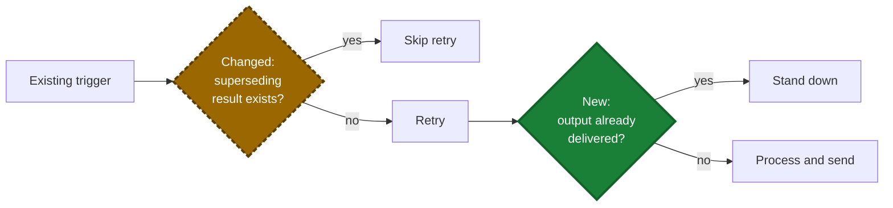

# Write a PR Description

Help a reviewer understand the system context, why the change exists, what behavior changed, and how to QA it within 60 seconds. Assume the reviewer has the diff open but does not know the affected code or workflow. Explain intent, end-to-end behavior, and risk — not implementation that is visible in the code.

Write for that reviewer. Every section must earn its place in the 60 seconds.

## Your Task

When asked to write or rewrite a PR description:

1. **Gather the facts.** Read the diff, the commits, and any linked issue, ticket, or user notes. Use only facts that these sources support. Never invent a path, a setting name, or a result.
2. **Classify the change.** The classification decides which sections the body gets:
   - The pull request is one layer of a stack → stack overview (Section 1).
   - The change alters a workflow, background job, retry, state transition, or component interaction → Mermaid diagram (Section 4).
   - The change alters stored data or an API payload → data table (Section 5).
   - A person can check the change by hand → QA section (Section 6).
   - The issue is known → closing keyword (Section 7).
3. **Draft in order:** stack overview when the PR is stacked (Section 1), opening (Section 2), what changed (Section 3), then the sections that step 2 selected.
4. **Run the self-check** (Section 9) before you deliver. This step is not optional.
5. **Omit empty sections.** A missing section reads better than a placeholder.

## Writing Style: ASD-STE100

Write the description in ASD-STE100 (Simplified Technical English) style. The reviewer is often tired and not a native English speaker. Each sentence must survive one read.

- Maximum 20 words per sentence in QA steps, 25 words elsewhere.
- Active voice, simple tenses. Write QA steps in the imperative: "Turn on **Lazyload**."
- One instruction per sentence. One topic per bullet.
- Put the condition before the command: "If the build fails, read the log."
- Use `can`, `will`, `must`. Do not use `should`, `would`, `may`, `might`, `could`.
- One term per concept in the whole description: pick one of check/verify/confirm, one of config/settings, and use no other.
- Keep code, identifiers, flags, paths, and quoted errors exact — they are exempt from every rule and count as one word each.

## 1. Stack overview

1.1. When the pull request is one layer of a stack, start the body with a stack overview above the opening. It is the only place that describes the other layers.

1.2. Detect a stack with `gh stack view --json` — exit code 2 means the branch is not in a stack. Without `gh stack`, the PR is stacked when its base branch is the head branch of another open PR (`gh pr view --json baseRefName`).

1.3. Open the block with `📚 Stack: <what the whole stack delivers>`. Follow it with one or two sentences that state the goal of the stack, the number of layers, the branch the stack sits on, and the review order. Say that each PR shows only its own diff.

1.4. List the layers as a numbered list, bottom layer first. Each item holds the PR title, its `#number`, then an em dash and the role of that layer. Mark the current layer with `📍` and `(this PR)`.

1.5. Keep each layer line to one line, 25 words maximum. The line states what the layer owns, not how it works.

1.6. Do not describe the other layers again. The What-changed bullets, the diagram, and the QA steps cover this PR's diff only.

1.7. Put the same overview in every PR of the stack, with `📍` on that PR's own layer. When a layer is added, merged, or renamed, refresh the list in each open PR.

1.8. A stacked PR does not target the default branch, so a closing keyword does nothing there (Section 7.4). Link the issue through the Development sidebar instead.

**Example:**

> **📚 Stack: Crisp support for bug/FR triage**
>
> Crisp joins HelpScout as a support platform for the bug-report and feature-request triage workflows. The work is stacked in three layers on `development` — review bottom to top, and each PR shows only its own diff:
>
> 1. 📍 `feat(support-platform): platform abstraction for bug/FR triage workflows` #178 (this PR) — platform abstraction: DTOs, the `SupportPlatform` interface, and the HelpScout adapter, behavior-neutral
> 2. `feat(crisp): Crisp triage intake via webhook` #179 — Crisp adapter and webhook intake: pulls the conversation, queues bug/FR triage
> 3. `feat(trail): store the platform on trail entries` #180 — trail provenance: the stored `platform` column and the `/trails/{platform}/{id}` URLs

## 2. Opening

2.1. Start with one or two plain-language sentences that state the bug or goal and the fix.

2.2. Do not add a TL;DR heading.

2.3. When you reference an external ticket or conversation, name the system and link it — `[HelpScout conversation 3393395616](url)`. Never write a bare `#id`: on GitHub it reads as an issue reference.

**Before:** TL;DR: This PR implements a comprehensive refactoring of the retry mechanism to properly handle edge cases around superseded results.
**After:** Failed imports retried even after a later run had delivered the output, so customers received duplicate emails. The retry job now stands down when a superseding result exists.

## 3. What changed

3.1. Write one bullet per logical behavior change, about six bullets maximum.

3.2. Lead with the outcome, not the implementation or the investigation.

3.3. Use a short before → after comparison when it helps.

3.4. When the diff contains unrelated changes, recommend a separate PR for them.

3.5. Start each bullet with the changed component in bold (`**Guard** — stands down when…`). A reviewer can then jump to the bullet that matches the file they have open. Separate bullets with a blank line so GitHub renders a padded list.

3.6. When a cross-cutting caveat exists — an assumption the fix relies on, or intentional behavior that a reviewer can read as a bug — put it in a `> [!NOTE]` callout after the bullets, not inline where it stretches a bullet.

**Before:** `- Updated RetryJob.php to add an early-return check in the handle() method`
**After:** `- **Retry job** — stands down when a later run has already delivered the output`

## 4. Visualize changed flows

4.1. When a change affects a workflow, background job, retry, state transition, guard sequence, or interaction between components, include a Mermaid diagram by default. Give an unfamiliar reviewer a high-level map of how the system behaves after the change.

4.2. Show the post-change end-to-end flow. Include enough unchanged context to show where the changed behavior sits. Do not create separate before and after diagrams unless highlighting cannot show the structural difference. Name the section after what it shows, such as `Import flow`.

4.3. Include the trigger, the important decisions, the component boundaries, the failure or retry paths when relevant, and the terminal outcomes. Keep the overview compact: prefer ten nodes or fewer, and collapse code-level details. Use the same product terms as the prose. Use named subgraphs only when ownership across components would otherwise be unclear.

4.4. Make every decision complete and logically consistent. Its outgoing labels must answer the question, be mutually exclusive, and cover the relevant exceptions. Prefer `Yes`/`No` when the criteria fit inside the decision. Otherwise state the criteria on both branches.

4.5. Apply status styling to the step or decision whose behavior changed, not to an unchanged downstream result:

- `added`: a new step, check, or branch condition
- `changed`: an existing step or decision whose rule changed
- unstyled: behavior unchanged in this pull request

Do not mark an existing outcome as added or changed merely because the pull request provides a new way to reach it.

4.6. Encode status in text as well as color. Prefix highlighted node labels with `New:` or `Changed:`, render added behavior as solid green, and render changed behavior as dashed amber:

4.7. Do not add a separate legend line. The `New:`/`Changed:` prefixes already carry status in text, and color is reinforcement, not the only signal.

4.8. Let the diagram carry sequence and branching. Keep the accompanying bullets for outcomes, caveats, or risk. Do not narrate every arrow again in prose. Omit the diagram only when the change has no meaningful flow to visualize.

4.9. GitHub scales the rendered diagram to the page width, so the diagram's geometry sets the on-screen text size — font-size directives change nothing. Prefer `flowchart LR`. Keep decision labels to two or three short lines: Mermaid inscribes the text box inside a rhombus, so a long label balloons the shape and the whole diagram. When the branch criteria do not fit a short edge label, state them in the prose bullets instead.

4.10. GitHub renders Mermaid in a sandboxed iframe and swallows the real error. Every failure — a parse error, a blocked iframe, an outdated Mermaid version — shows the same banner: `Unable to render rich display` above the raw code. Write defensively:

- Wrap every node and edge label in double quotes: `A["Merge development → master"]`, `B{"New: commit?"}:::added`. Unquoted labels break on `(`, `)`, `{`, `}`, `|`, and `"`. Quotes keep ` ` and `:::class` intact.
- Do not put a literal `"` inside a label. Reword the label instead.
- Do not use `end` as a node ID — it is a reserved word in flowcharts. `End` and `"end"` inside a quoted label are safe.
- GitHub's Mermaid version lags the latest release. Use plain flowchart syntax only. Do not use features from recent Mermaid releases.
- When a diagram renders on [mermaid.live](https://mermaid.live) but GitHub still shows the banner, the syntax is not the cause. Reload the page and check for content blockers on `viewscreen.githubusercontent.com` before you rewrite the diagram.

## 5. Data changes

5.1. When stored data or an API payload changes, use a small table that shows the key, the value, and the owner or lifetime, plus one before → after line.

5.2. Omit otherwise.

## 6. QA

6.1. Never write a Verification section — no test summaries, tool invocations, or raw counts, even when you rewrite a description that had one. Tests are visible in the diff, and CI reports the results.

6.2. The only testing content is a QA section: numbered manual steps that a QA person can follow, with the original regression scenario first. End each step with a standalone `**Expect:**` line that states the observable result, separated from the action.

6.3. Spell out every screen that a QA person must go through to reach the setting a step touches. Start from a fixed place such as WP Admin and name each menu, tab, and section along the way — `WP Admin → Media → Optimole → Settings → Advanced → Lazyload`, not "enable lazyload". Assume the QA person has never opened the feature and must never have to hunt for it.

6.4. When the path is not obvious, name what gates it: the role or capability required to see the menu, and any tab, accordion, or "Show advanced" control the setting hides behind. Where a URL is stable, give the URL instead of the path — `/wp-admin/options-general.php?page=optimole#advanced`.

6.5. Omit the section when there is nothing meaningful to check by hand.

6.6. When a step needs something a QA person cannot do through the product (plant a database row, mark a run failed), give the exact snippet — tinker, SQL, or CLI — in a fenced code block, plus any ordering constraint it depends on.

6.7. Spend QA steps on what automated tests cannot cover — live third-party behavior, assumptions about external systems. Do not hand-replicate scenarios that the diff's tests already prove.

**Before:**
> 3. Enable lazyload and verify it works.

**After:**
> 3. Go to `WP Admin → Media → Optimole → Settings → Advanced → Lazyload`. Turn on **Lazyload** and save.
>
>    **Expect:** images below the fold load only when scrolled into view, and the setting stays on after a page reload.

## 7. Link the issue on GitHub

7.1. When the issue is known, always link it with a closing keyword on its own line at the end of the body. The keyword is GitHub's only API-level linking mechanism — no REST or GraphQL mutation exists for it, so the keyword in the PR body *is* the API. GitHub then lists the PR under the issue's Development section and closes the issue on merge.

7.2. Derive the reference from the issue URL — `https://github.com/OWNER/REPO/issues/123`:

- Same repository as the PR: `Closes #123`
- Different repository: `Closes OWNER/REPO#123`
- Several issues: repeat the keyword for each — `Closes #123, closes OWNER/REPO#456`

7.3. Accepted keywords are `close`/`closes`/`closed`, `fix`/`fixes`/`fixed`, `resolve`/`resolves`/`resolved`. Prefer `Closes` for issues and `Fixes` for bugs. A bare `#123` without a keyword creates only a cross-reference, never a link.

7.4. GitHub interprets the keyword only when the pull request targets the repository's **default branch**. When the PR targets anything else — a release or stacked branch — the keyword silently does nothing. Link the PR through the **Development** sidebar instead, and say so outside the ready-to-paste description.

7.5. Never change an existing pull request's target branch, and never suggest changing it, to make a closing keyword work. The target is a release decision; keyword linking is not a reason to touch it. Keep the keyword out and note the Development-sidebar step instead.

7.6. When you open a new pull request and the user has not named a target, default to `development` if that branch exists on the remote (`git ls-remote --heads origin development`), otherwise the repository's default branch.

7.7. Keep the keyword in the PR body, not in a commit message. A keyword in a commit closes the issue but does not list the pull request as linked.

7.8. Link the pull request itself, never the branch. A branch named after the issue (such as `bugfix/686`) shows up in Development as a branch link — that is not enough. Verify that the Development section lists the PR, and remove leftover branch-only links.

7.9. Automatic closure is the intended behavior here. Only when the user says the issue must stay open after merge, drop the keyword and link through the Development sidebar — GitHub offers no keyword that links without closing.

## 8. Do not include

| You wrote | Write instead |
|---|---|
| A Verification section, test summaries, tool invocations, raw counts | Nothing — CI reports test results. Manual checks go in QA (Section 6). |
| A line-by-line retelling of the diff | One bullet per behavior change (Section 3). |
| Investigation history ("first I tried…") | The outcome. |
| "robust", "comprehensive", "properly", "simply" | Delete, or state the measurable behavior. |
| An empty section or a placeholder | Omit the section. |
| Jargon or codenames that do not appear in the product or code | The term the product uses. |
| Invented paths, settings, or results | Only facts from the diff, commits, issue, or user notes. |
| Sensitive information (keys, customer data, internal URLs) | Omit it. |

## 9. Self-Check Before You Deliver

This step is not optional. Run these checks on your draft, fix what you find, then deliver:

1. If the PR is stacked, the body opens with the stack overview, the current layer carries `📍` and `(this PR)`, and no other layer's diff is described elsewhere.
2. Count the opening sentences. More than two → cut to the bug and the fix.
3. Count the What-changed bullets. More than six → merge them, or recommend a separate PR.
4. Search the draft for `TL;DR`, `Verification`, `robust`, `comprehensive`, `properly`, `simply`. Delete every hit.
5. Search for `should`, `would`, `might`, `could`, and contractions (`'ll`, `'re`, `'s`). Replace a requirement with `must` and a possibility with `can`. Expand contractions.
6. Count words in your three longest sentences. Over the 20/25 limit → split them.
7. Check every external ticket reference: it names its system and links, never a bare `#id`.
8. Check the diagram: ten nodes or fewer, every label sits in double quotes with no `"` inside, no node ID is `end`, every highlighted node has a `New:` or `Changed:` prefix, and every decision's outgoing labels answer its question and are mutually exclusive.
9. Check every QA step: it ends with a standalone `**Expect:**` line, and its path starts from a fixed place and names each screen.
10. Check the closing keyword: it sits on its own line at the end of the body. If the PR does not target the default branch, remove the keyword and note the Development-sidebar step outside the description.
11. Trace every fact to the diff, a commit, the issue, or the user's notes. Delete what does not trace.
