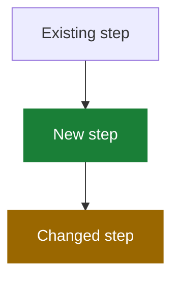

# PR Description Structure Overview

Target: a reviewer should know what to look at and why within 60 seconds of skimming. Every sentence must help them review; anything else is cut.

### TL;DR

One or two sentences at the very top: the bug/goal and the fix, plain language. No section header needed — it's the opening paragraph.

### What changed

- One bullet per logical change. Lead each bullet with the change, not the backstory.
- Max ~6 bullets. If you have more, the extras are probably drive-by fixes — move them to "Also in this PR".
- State behavior before → behavior after when it fits in the same line ("disable used to force `private`; now restores the recorded status").
- Root-cause context is welcome but capped at 2–3 sentences before the bullets. Don't retell the whole investigation.

### Also in this PR

Drive-by fixes, hardening, and CI changes that aren't the core change. Keeping them separate tells the reviewer what needs deep review vs. a glance. One line each. Omit the section if empty.

### Where to start reviewing

2–4 lines pointing at the heart of the diff: the file/function carrying the behavior change, and which files are mechanical (renames, test fixtures, generated). This is the highest-value section for a reviewer — don't skip it on non-trivial PRs.

### Mermaid diagram

Include one only when the PR changes a flow or lifecycle — not for simple fixes. Rules:

- Color-code nodes by what this PR did to them, and include a legend:

- Legend line under the diagram: 🟩 green = added by this PR, 🟨 amber = behavior changed, gray/default = untouched.
- Use explicit `fill` + `color` so it stays readable in GitHub dark mode.
- Diagram the *new* behavior; don't draw before-and-after twins.

### Data transformation

If the PR adds/changes stored data (DB columns, meta keys, file formats, API payloads): a small table with key, value, and lifetime/owner, plus a one-line before → after. Omit otherwise.

### QA instructions

- Numbered steps a human can follow, each ending with the expected observable result.
- Only list steps NOT covered by automated tests; state what the tests already cover in one closing line ("`tests/page-state-test.php` covers steps 1–3 via the real AJAX handler").
- Include the regression check for the original bug as step 1.

### PR metadata

Issue links (`Fixes #123`), base branch if not default, related PRs. Use GitHub's native linking keywords so the issue auto-closes.

## Do not include

- Self-praise or narrative color: "good citizen", "robust", "comprehensive", "along the way", "properly". Describe the change; let the reviewer judge it.
- The investigation story. The PR shows the destination, not the journey.
- Restating the diff line-by-line — the reviewer has the diff open.
- Bold-word emphasis scattered through prose; bold only labels.
- Sensitive information (secrets, API keys, customer data).
- Jargon or codenames invented during the work that don't appear in the code.
